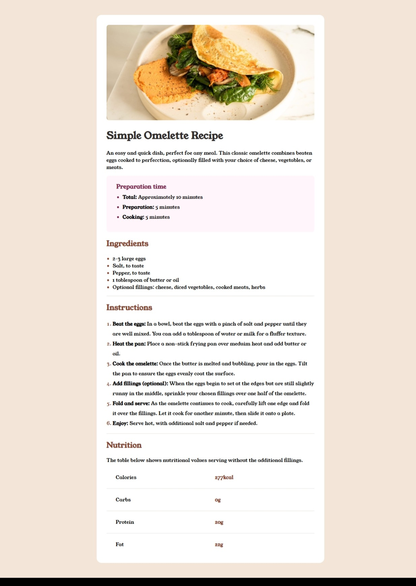

# Recipe page solution

This is my solution to the [Recipe page challenge on Frontend Mentor](https://www.frontendmentor.io/challenges/recipe-page-KiTsR8QQKm).

## Table of contents

- [Overview](#overview)
  - [Screenshot](#screenshot)
  - [Links](#links)
- [My process](#my-process)
  - [Built with](#built-with)
- [Author](#author)
- [Acknowledgments](#acknowledgments)

## Overview

### Screenshot

The above is a screenshot to my solution of the project.

### Links

- GitHub Link: (https://github.com/seysbk)

## My process

### Built with

- Semantic HTML5 markup
- CSS custom properties
- CSS Grid

## Author

- Seyram Borloe Kuvuordo
- Frontend Mentor - [@seysbk](https://www.frontendmentor.io/profile/seysbk)
- Instagram - [@sey.sbk](https://www.instagram.com/sey.sbk)

## Acknowledgments
Shout out to Enoch Hono. Frontend Club Lead (2024/2025) University of Cape Coast, Ghana.